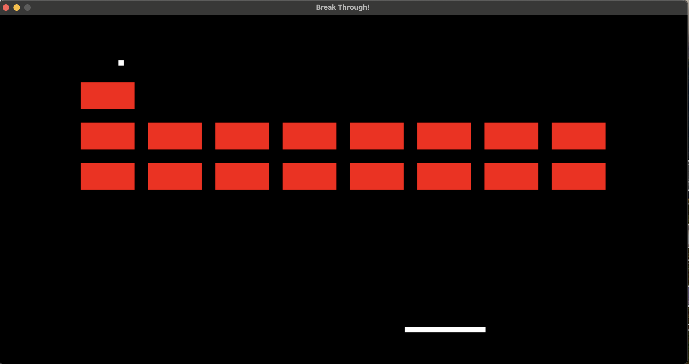

# Game Collection

This repository contains three classic arcade games built with Python and Pygame: Pong, Ball-Clicker, and Break Through Each game includes unique features and mechanics to provide a fun and engaging experience.

## Pong

Pong is a two-player game where players control paddles to hit a ball back and forth across the screen. The goal is to prevent the ball from getting past your paddle while trying to get it past your opponent's paddle.

### Features
- Player vs. Computer gameplay
- Smooth paddle controls
- Simple and classic gameplay mechanics

### Screenshot


### How to Play
1. Use the arrow keys to move your paddle up and down.
2. Keep the ball in play by hitting it with your paddle.
3. Try to get the ball past the opponent's paddle to score points.

## Ball-Clicker

Ball-Clicker is a simple game where you have to click on a moving ball to score points. The game tracks your accuracy and score as you play.

### Features
- Track accuracy and score
- Simple mouse click mechanics
- Increasing difficulty as the ball moves faster

### Screenshot


### How to Play
1. Click on the ball as it moves across the screen.
2. Your score and accuracy are displayed at the top of the screen.
3. Try to achieve the highest score possible.

## Break Through

Break Through is a game where you control a paddle to hit a ball and destroy blocks. The objective is to clear all the blocks on the screen without letting the ball fall below your paddle.

### Features
- Multiple rows of blocks to break
- Paddle and ball mechanics
- Victory and defeat conditions

### Screenshot


### How to Play
1. Use the arrow keys to move your paddle left and right.
2. Hit the ball with your paddle to break the blocks.
3. Clear all the blocks to win the game. If the ball falls below your paddle, you lose.

## Installation

To run these games, you need to have Python and Pygame installed on your machine.

1. **Clone the repository:**
   ```bash
   git clone https://github.com/aryanp05/Python-Arcade-Games.git
   ```
2. **Navigate to the project directory:**
   ```bash
   cd Python-Arcade-Games
   ```
3. **Install Pyagem:**
   ```bash
   pip install pygame
   ```
4. **Open your preferred game:**
   ```bash
   python pong.py
   python clicker.py
   python block_breaker.py
   ```
